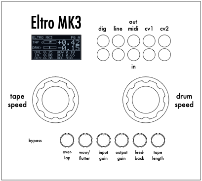

# Eltro MK3

A Eurorack effects module: a digital emulation of the **Eltro Tempophon** —
the rotating-head tape pitch/time changer famously used to create HAL 9000's
voice in *2001*.




Live audio in → a buffered "tape" scanned by four virtual read heads → audio
out, with **time and pitch decoupled into two independent axes** (tape and
drum) — the same trick the real machine used, modelled directly rather than
approximated with a generic granular time-stretch.

Built on the **AMYboard** (ESP32-S3) using the **AMY** synth library, with an
M5Stack 8Angle for control, an SH1106 OLED for display, CV inputs, and MIDI
RX/TX.

## Features
- Two-axis DSP: progression (time) and pitch as independent parameters
- Silence-at-freeze, reverse-scan, and speed/pitch decoupling — all modelled
  from the physical machine's behaviour, not faked
- 2× CV inputs (tape, drum)
- MIDI RX (CC control with per-knob pickup/catch takeover) and MIDI TX
  (knob movement → CC out)
- OLED UI with two parameter pages, persisted settings
- 3D-printed Eurorack panel and matching knobs

## Status
Working, hardware-confirmed final prototype. See `CHANGELOG.md` for version
history.

## Repository structure
```
firmware/       Arduino sketch (eltro_mk3_v12) + font table
hardware/       3D-printable panel, knob, and case STLs, panel design source
docs/           Build guide, BOM, user manual, technical notes
```

The skiff case is a remix of a third-party CC BY 4.0 design — see
`hardware/CASE_NOTE.md` for attribution.

## Getting started
- **Building one yourself:** start with `docs/BUILD_GUIDE.md` and `docs/BOM.md`
- **How it works technically:** `docs/TECHNICAL_NOTES.md`
- **How to use it once it's built:** `docs/manual/Eltro_MK3_Manual.pdf`

## Dependencies
- [AMY](https://github.com/shorepine/amy) synth library (MIT licensed) —
  not bundled here, install separately

## License
- Firmware (`firmware/`): MIT — see `LICENSE-CODE.md`
- Hardware designs and documentation (`hardware/`, `docs/`): CC BY-SA 4.0 —
  see `LICENSE-HARDWARE.md`

## Credits
Built by [YOUR NAME]. Digital emulation of the Eltro Tempophon concept;
"itty-bitty bits, cross-faded" description of the segment-crossfade
mechanism is Wendy Carlos's, describing the original hardware.
